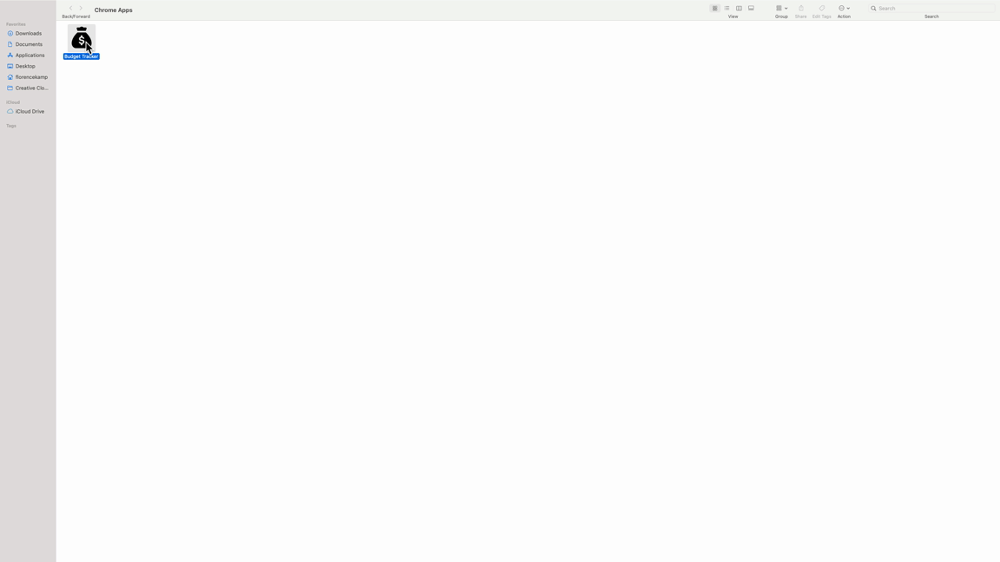

# Budget Tracker

## Description

Giving users a fast and easy way to track their money is important, but allowing them to access that information at any time is even more important. Having offline functionality is paramount to the success of an application that handles users’ financial information.

Budget Tracker is an application that allows you to track your income and expenses.

Features:

# Add transactions offline

# PWA app

## Contributing

Feel free to send pull requests and raise issues.

## Questions

My GitHub: [flokamp](https://github.com/flokamp)

If you have additional questions, email me! kampflo2@gmail.com
